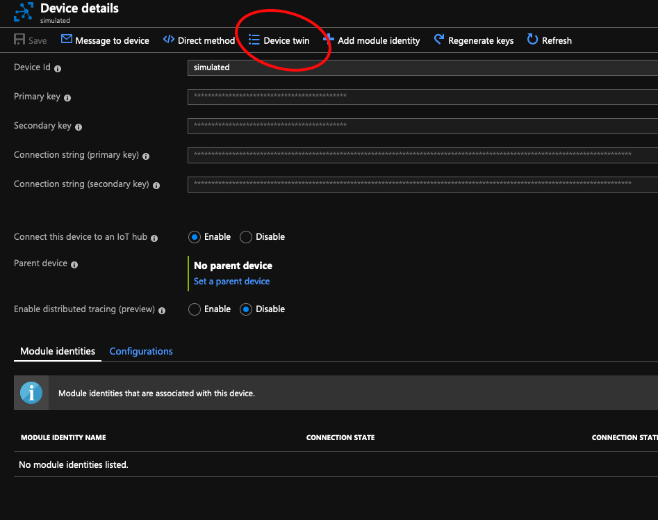
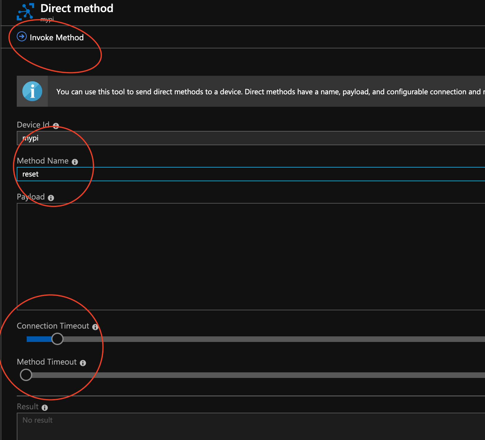
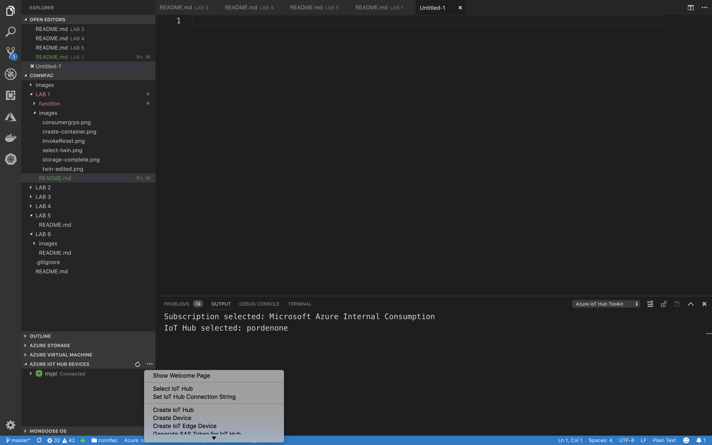

# Azure IoT Hub
For this lab we will work a lot with IoT Hub. We will explore most of its functions using a device simulator.

## Step-by-step guide
Sign in to <http://portal.azure.com>

### Create/Select Resource group 
On the left pane choose Resource Groups.
1. Click the "+ Add" button to create a new Resource group, or in case a Resource Group has been assigned, choose it.
2. Give the Resource group a name and choose North Europe as region

### Create IoT Hub
(You might need to the refresh icon in Azure to see your new Resource group)
1. Select your Resource group and then click the "+ Add" button to add an IoT hub
2. Search for IoT Hub and then click “Create”
3. Select the subscription, Resource Group and Region
4. Give it a unique name. An IoT Hub is fully addressable from the public internet!!!
5. Click “Next: Size and scale“
6. Select the S1 pricing tier, 1 unit is enough
7. Press “Review + create“
8. Verify the settings and press “Create“
 
Go back to your Resource group and verify that the IoT Hub there

Now we will add a few consumer groups, which we will need later. On the IoT Hub blade, select Built-in endpoints and create two consumer groups, call one asa and another timeseries.  


### Provision and start sending telemetry from a simulated device
1. Go to IoT Hub and click IoT Devices on the left panel (blade)
2. On the IoT Devices page click **"+ Add"** and give the IoT device a name e.g. **Simulator**
3. After you created a new device click refresh on the IoT Device page until the new device appears.
4. Select the device and save the Connection string (primary key) you will need this to run the **Device Simulator** app. 
5. Follow the [Device simulator guide](https://github.com/lucarv/aziot_devsim). Make sure you install the simulator on the raspberry pi
6. Verify, as expected, that once the device connects, it immediatelly receives the desired properties of the device twin document. As we have not set any properties yet, all we see is the version number of the document.
7. Let's now inspect the device twin document using the Portal  
We are taken into a pane that shows the json document. Inspect it and locate the desired properties section  


8. This document is fully editable from the portal, so let's start the device telemetry by selecting its telemetry state to true and choosing a sampling interval. Add the following json to the twin document, right at the beginning of the desired properties section
```
"telemetry": {
    "status": true,
    "interval": 3000
},
```


9.  Press "Save" to send the property to the device. 
10. Verify the telemetry arriving at IoT Hub. Look on the IoT Hub Overview page and see “Usage” (Hit refresh and verify that the messages count is increased)
11. You can toggle the telemetry on and off by setting the desired property _telemetry.status_ to true/false. Try that now. 
    
## Invoke a direct method
1. Verify the invocation of a direct method. Select your device in the portal. Verify that the device resets and the temperature starts from 25C again.
 


Note that depending on the quality of the network and the load on the device and IoT Hub, it may be a good idea to adjust the time out parameters.  

## Visual Studio Code

If you have not yet done it, now is a good time to install Visual Studio Code and the Azure IoT Hub Tool extension. Once You have done that, right click on the extension and select your IoT Hub. You can do that by clicking on the elipsis (the periods) next to the extension on VS Code.



Once that is done, the extension will show your devices. Right click on your device and select "Start Monitoring Built In Endpoint". See your messages appear in the lower tab of VS Code

## Save telemetry to cold storage for archival purposes

One very common requirement in Iot projects is to store all incoming data for later processing, This is what we usually call the **cold path**. The cheapest storage available in Azure are blob storages, and we will save messages there  

### Create Blob storage
1. Select your Resource group and then click the "+ Add" button to add a Storage Account
2. Search for Storage Account and then click “Create”
3. Select the subscription, Resource Group and Region
4. Give it a unique name. A Storage Account is fully addressable from the public internet!!!
6. Leave everything else with default settings
7. Press “Review + create“
8. Verify the settings and press “Create“
9. When the resource is created, go to it


10. On the landing blade, Select Blobs
11. Create a Container by Pressing the appropriate Button. Give it a name and select "Container" as Public Access level


### Create a route to storage
IoT Hub works by declarative routing, and so far we have used the default route. We will now create a new route to send telemetry from sensors to the cold storage.

1. Go back to your IoT Hub
2. Select "Message Routing". Choose the "Custom endpoints" tab.
3. Create a new Custom endpoint. Press "+ Add" and choose Blob Storage from the drop down menu. Give the end point a name and pick the container we have created. Select "Create"
4. Enter the Routes tab and press "+ Add". Give your route a name, select your blob as endpoint. On the query, let's route only if a device is of type simulated. This info is sent by the device simulator as a header (in the sample code). 
Write 
```
deviceType = 'test' 
```
on the Routing query field. Press "Save".
5.  Start the telemetry again by setting the status to true on the twin document
6. Once the route is activated, you may notice that the telemetry is no longer showing. Can You think of the reason for that?
7. Wait a little and verify that the blob has now telemetry stored.

One drawback from using message routing in IoT Hub is that once a rule is matched, the telemetry is removed from the queue and can't be consumed by other applications. There are ways around this but for now let's just disable the route on the Portal. 

[NEXT LAB](https://github.com/lucarv/connfac-lab/tree/master/LAB%202)
