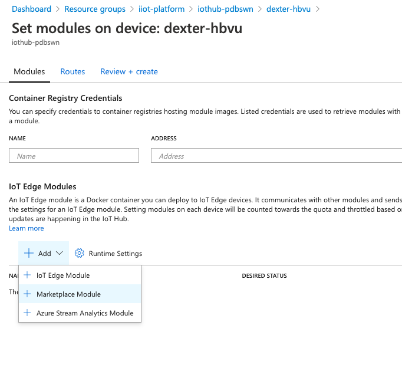

# LAB 4. Azure Industrial IoT

For this lab we will implement move into opc-ua territory. We will add an OPC-UA publisher to the EDGE device, subscribe to a few nodes and publish the node values to the IoT Hub.


We will need to create an new deployment manifest that includes the opc-ua publisher.  

## Create config file on the Edge device  

This module needs to read a config file that contains information about the OPC-UA servers and nodes that it should connect too.  
We will need to store this configuration file on the edge device and subsequently mount it so it is available for the module.  

Let's do that first!


1. SSH into the edge device
2. Create a folder called iotedge with a file called **pn.json**. Run the following commands:
```
> mkdir iotedge  
> cd iotedge  
> nano pn.json
```
3. Insert the following lines in the pn.json file, save and exit nano.
```
[
  {
    "EndpointUrl": "your OPC UA server address",
    "UseSecurity": false,
    "OpcNodes": [
      {
        "Id": "some tag",
        "OpcSamplingInterval": 1000,
        "OpcPublishingInterval": 5000,
        "DisplayName": "Some Tag Friendly Name"
      },
      {
        "Id": "another tag",
        "OpcSamplingInterval": 1000,
        "OpcPublishingInterval": 5000,
        "DisplayName": "Another Tag Friendly Name"
      }
    ]
  }
]
```
The pn.json file contains a json array. Each element in the array contains a json object that describes the OPC-UA server the publisher will connect to. You can connect to as many servers as you need. Make sure you know the absolute path to this file, you will need later to map thios volume into docker.
Each server will have a number of nodes you need to publish to IoT Hub. This is defined in the OpcNodes element of the server json object. You can add as many nodes as You want.  

## Create the deployment manifest

Go back to the Portal and add a new module for the opc-ua publisher. We can easily do that from the Marketplace.  
Go to Your device in the Portal an go all the way to Set Modules. Dropdown the 'ADD' menu and choose market place.
 . 

search for OPC Publisher. This will pre-populate the deployment manifest with some default values. We need to change that. Click the module name, then choose Container Create Options. Replace the pre-populated defaults with the JSON below: 


```
{
  "Hostname": "publisher",
  "Cmd": [
    "--pf=./pn.json",
    "--aa"
  ],
  "HostConfig": {
    "Binds": [
      "/home/<USER>/iotedge:/appdata"
    ]
  }
}
```  

Add a route so the publisher sends data to the IoT Hub. You should be able to figure out what to add in the "Specify Routes" tab...  
``` 
{
    "routes": {
      <YOUR EXISTING ROUTES>
      , "opcPubToCloud": "FROM /messages/modules/OPCPublisher/* INTO $upstream"
    }
}
```

Push the manifest to the edge device. This module is quite big, so it might take a while before it is ready. Keep checking your device on the Portal (or on the edge, by issuing the _iotedge list_ command), when it is ready, you should be able to see telemetry from the OPC-UA Server coming into the IoT Hub


[NEXT LAB](https://github.com/lucarv/connfac-lab/tree/master/LAB%205)
