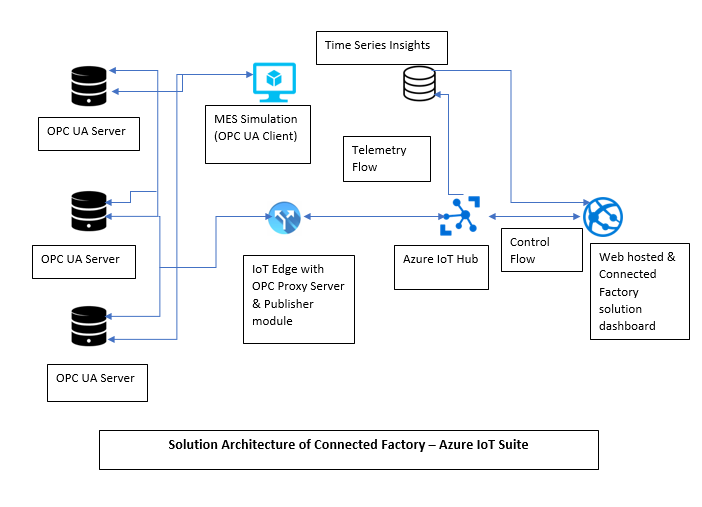

# Azure Connected Factory  

**3 Day Proctor assisted Hands-on LAB**

## Welcome !
This Cloud Workshop is very hands-on intensive. And wewill be doing it a bit different from most labs.  
We will be getting our hands dirty from the start. We will make pauses when appropriate to discuss what we have done, but also the whys and hows.  

Please follow the instructions step-by-step. We have noticed that 9 out of 10 times when things don't work is because we have accidentally missed one or more steps. For that odd cases, we might even hand out a cool sticker for those who help us correct/improve the instructions.

At the end of these 3 days we will be prod=udy showing a fully functioning Connected Factory solution, like the one below, and even better!

## Prerequisites

- A laptop with node.js, Docker and Visual Studio Code.
- IoT Hub, IoT Edge and Docker extensions for VSC.
- One Raspberry Pi per group of maximum 3 people.

## Agenda - Day ONE

- [LAB 1](https://github.com/lucarv/connfac-lab/tree/master/LAB%201)
- Azure IoT Hub Fundamentals  
- Recap: Lambda Architecture for IoT
- [LAB 2 (Batch Layer)](https://github.com/lucarv/connfac-lab/tree/master/LAB%202)
- [LAB 3 (Speed Layer / Serving Layer)](https://github.com/lucarv/connfac-lab/tree/master/LAB%203)
- Building a Lambda Architecture on Azure Cloud
- [LAB 4](https://github.com/lucarv/connfac-lab/tree/master/LAB%204)
- Azure IoT Edge Platform Concepts and Fundaments

